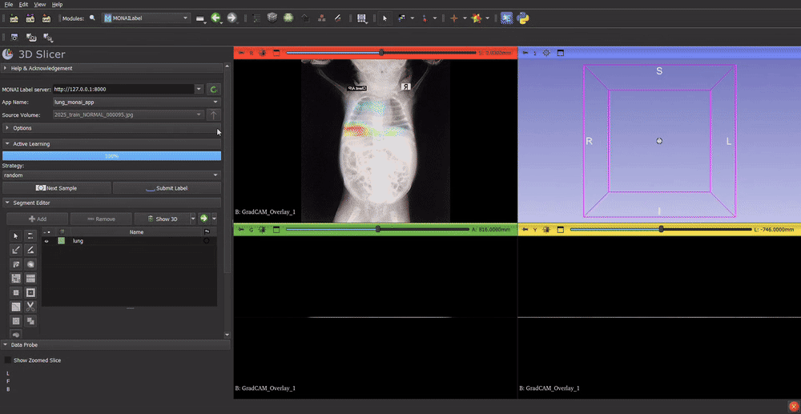

# X-ray Pneumonia Project

Production-oriented chest X-ray pipeline for lung segmentation, manual mask
refinement, pneumonia classification, domain-shift experiments, calibration,
AmbiGAN boundary generation, and Hubris-aware training.

The project is config-driven. Production code lives under `src/`, executable
entrypoints under `scripts/`, and experiment definitions under `configs/`.

## Demo



## Main Workflows

| Workflow | Entrypoint | Guide |
|---|---|---|
| Training | `scripts/train_*.py` and experiment runners | [Train Guide](docs/train_guide.md) |
| Evaluation and ablation | `scripts/run_task11_evaluation.py` | [Evaluation Guide](docs/evaluation_guide.md) |
| MONAI Label inference | `monai_apps/lung_monai_app` | [MONAI Label Guide](docs/monai_label_guide.md) |
| Manual mask refinement | `scripts/run_slicer_refinement.py` | [3D Slicer Guide](docs/slicer_guide.md) |
| Full orchestration and report | `scripts/run_full_pipeline.py` | [Project Architecture](docs/project_architecture.md) |

## Demo Videos

- [Lung segmentation demo](docs/assets/videos/lung_segmentation.mp4)
- [Full mode demo: segmentation, refinement, and classification](docs/assets/videos/full_mode.mp4)

## Environment

The validated environment uses Python 3.10. Install the core dependencies:

```powershell
conda create -n lung_app python=3.10
conda activate lung_app
pip install -r requirements.txt
```

Install MONAI Label dependencies when using the annotation server:

```powershell
pip install -r environment/requirements-monai-app.txt
```

Known-good package versions are recorded in
`environment/task0_runtime_constraints.txt`.

## Full Pipeline

Validate orchestration without training:

```powershell
python scripts/run_full_pipeline.py `
  --config configs/pipelines/full_pipeline.yaml `
  --dry-run
```

Run enabled stages:

```powershell
python scripts/run_full_pipeline.py `
  --config configs/pipelines/full_pipeline.yaml
```

The runner supports stage enable/disable in YAML, output validation, resume,
and forced reruns:

```powershell
python scripts/run_full_pipeline.py --force-stage classification_2025
python scripts/run_full_pipeline.py --no-resume
```

Manual Slicer review remains disabled in the default full-pipeline config.
Run the pre-Slicer stages, review labels, then enable or invoke the post-Slicer
workflow after corrected labels exist.

Final reports are written to:

```text
outputs/full_pipeline/final_report.md
outputs/full_pipeline/final_report.html
```

## 3D Slicer Visualization And Editing

Use this workflow when you want to review X-rays in 3D Slicer, edit the lung
mask, and run the ChestAnalyze view with GradCAM, anatomy, and lesion
visualization.

### 1. Start The MONAI Label Server

From the project root:

```powershell
.\scripts\start_monai_lung_app.ps1
```

The script uses:

```text
C:\Users\lenovo\.conda\envs\lung_app\python.exe
```

and starts the MONAI Label app with:

```text
--app monai_apps\lung_monai_app
--studies data\qc\fail_qc\images
--conf models all
--conf anatomy_device cpu
--conf anatomy_num_threads 2
--conf lesion_device cpu
--conf lesion_num_threads 2
--conf lesion_shift_pixels 64
--conf lesion_mask_logit_threshold 1.0
```

To make `Next Sample` show images from a different folder, change the
`--studies` path in [scripts/start_monai_lung_app.ps1](scripts/start_monai_lung_app.ps1).
Then restart the server.

### 2. Load The Slicer Module

Open 3D Slicer and add this module directory to Slicer's additional module
paths:

```text
pneumonia_slicer_app\slicer_module
```

Restart Slicer or reload modules, then open **Chest Analyzer**.

### 3. Connect And Load A Case

In Slicer:

1. Set MONAI Label server URL to:

   ```text
   http://127.0.0.1:8000
   ```

2. Click **Mode 1: Open MONAI Label lung segmentation**.
3. In the MONAI Label panel, connect to the server.
4. Click **Next Sample** to load an X-ray from the `--studies` folder.
5. Select `lung_segmentation` and run inference.

### 4. Edit The Lung Mask

Use **Segment Editor** to fix the lung mask. After editing, submit/save the
label through MONAI Label so the corrected mask can be reused.

Corrected labels are stored under the MONAI Label studies folder, typically:

```text
data\qc\fail_qc\images\labels\final
```

### 5. Run ChestAnalyze

Go back to **Chest Analyzer**, select:

- **X-ray volume**: the loaded chest X-ray.
- **Optional edited lung mask**: the edited segmentation node.

Then click:

```text
Mode 2: ChestAnalyze
```

The custom layout shows:

```text
Yellow top panel  : MedicalPatchNet lesion visualizations
Red bottom panel  : classifier GradCAM
Green bottom panel: anatomy segmentation overlay
```

Anatomy and lesion inference use the crop/bbox derived from the selected edited
lung mask when available.

### 6. Outputs And Logs

ChestAnalyze writes the structured JSON draft to:

```text
C:\Users\lenovo\AppData\Local\Temp\chest_analyze_report.json
```

Debug images for lesion visualization are written to:

```text
C:\Users\lenovo\AppData\Local\Temp\ChestAnalyzerDebug
```

Slicer-side debug logs are written to:

```text
pneumonia_slicer_app\slicer_module\ChestAnalyzer\ChestAnalyzer_debug.log
```

Anatomy inference logs are written to:

```text
monai_apps\lung_monai_app\anatomy_infer_debug.log
```

## Tests

```powershell
python -m unittest discover -s tests -t .
```

The suite covers unit behavior, executable entrypoints, MONAI integration, and
legacy parity.

## Repository Layout

```text
configs/                 Active YAML configuration
configs/legacy/          Archived experiment configuration
docs/                    Final guides, architecture, audits, task history
environment/             Runtime requirements and constraints
monai_apps/              MONAI Label application
notebooks/               Current launcher notebooks
notebooks/legacy/        Archived notebooks
pneumonia_slicer_app/    Slicer module and compatibility API
scripts/                 Production entrypoints
scripts/dev/             Manual smoke/development utilities
scripts/legacy/          Archived compatibility wrappers
scripts/legacy_validation/ Parity and baseline utilities
src/                     Reusable production implementation
tests/                   Unit, integration, parity, and fixtures
```

Runtime data, outputs, checkpoints, and local environments are intentionally
excluded from source control.

Model checkpoints are not distributed through Git. Train/export them locally
or obtain them separately before running model-dependent workflows.
