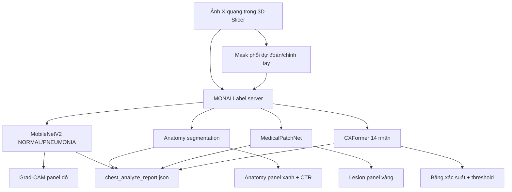

# Hệ thống phân tích X-quang ngực với MONAI Label và 3D Slicer

Project này là một hệ thống hỗ trợ nghiên cứu ảnh X-quang ngực 2D. Hệ thống kết hợp nhiều mô hình để:

- phân đoạn phổi và cho phép chỉnh mask thủ công trong 3D Slicer;
- phân loại nhị phân `NORMAL / PNEUMONIA`;
- phân đoạn giải phẫu gồm phổi phải, phổi trái và tim;
- ước lượng chỉ số tim-ngực `CTR`;
- phân loại đa nhãn 14 bất thường bằng CXFormer;
- tạo bản đồ bằng chứng tổn thương bằng MedicalPatchNet;
- xuất kết quả tổng hợp dưới dạng JSON.

> **Lưu ý:** đây là phần mềm nghiên cứu, chưa phải thiết bị y tế và không được dùng thay cho chẩn đoán của bác sĩ. Heatmap, Grad-CAM và mask tổn thương là vùng bằng chứng do mô hình ước lượng, không phải ground-truth lesion mask.


## 1. Trạng thái hiện tại

MONAI Label app hiện đăng ký 5 inference endpoint:

| Endpoint | Mô hình | Kết quả chính |
|---|---|---|
| `lung_segmentation` | U-Net, encoder ResNet34 | Mask phổi nhị phân có thể chỉnh sửa |
| `classifier` | MobileNetV2 | `NORMAL/PNEUMONIA`, xác suất và Grad-CAM |
| `anatomy_segmentation` | `ianpan/chest-x-ray-basic` | Phổi phải, phổi trái, tim và CTR |
| `lesion_localization` | `patrick-w/MedicalPatchNet` | 14 xác suất và patch-evidence overlay |
| `cxformer_pathology` | `m42-health/CXformer-small` + linear head | 14 xác suất VinBigData với threshold riêng từng lớp |

Module **Chest Analyzer** trong 3D Slicer gọi cả bốn nhánh phân tích sau khi người dùng đã chọn ảnh:

1. MobileNetV2 phân loại `NORMAL/PNEUMONIA`.
2. Mô hình anatomy phân đoạn phổi phải, phổi trái và tim.
3. MedicalPatchNet tạo bảng finding và ảnh localization.
4. CXFormer tạo bảng xác suất 14 nhãn.

Giao diện ảnh gồm ba panel:

| Panel | Nội dung |
|---|---|
| Đỏ | Grad-CAM của MobileNetV2 |
| Xanh lá | Anatomy overlay: phổi phải, phổi trái và tim |
| Vàng | MedicalPatchNet patch-evidence overlay |

CXFormer hiện chỉ hiển thị kết quả trong bảng bên trái và không điều khiển panel ảnh. `ChestAnalyzer` gửi `include_localization=false` cho endpoint CXFormer để tránh nhầm heatmap CXFormer với MedicalPatchNet.

## 2. Hai bộ 14 nhãn không giống nhau

### 2.1. Nhãn CXFormer/VinBigData

Checkpoint CXFormer dự đoán 14 bất thường sau:

1. Aortic enlargement
2. Atelectasis
3. Calcification
4. Cardiomegaly
5. Consolidation
6. ILD
7. Infiltration
8. Lung Opacity
9. Nodule/Mass
10. Other lesion
11. Pleural effusion
12. Pleural thickening
13. Pneumothorax
14. Pulmonary fibrosis

Đầu ra là 14 sigmoid độc lập. Mỗi lớp dùng threshold riêng trong:

```text
checkpoints/cxformer/thresholds_for_future_final_model.csv
```

Do đó một ảnh có thể có nhiều finding cùng lúc hoặc không có lớp nào vượt threshold.

### 2.2. Nhãn MedicalPatchNet

MedicalPatchNet dùng bộ nhãn khác:

1. No Finding
2. Enlarged Cardiomediastinum
3. Cardiomegaly
4. Lung Opacity
5. Lung Lesion
6. Edema
7. Consolidation
8. Pneumonia
9. Atelectasis
10. Pneumothorax
11. Pleural Effusion
12. Pleural Other
13. Fracture
14. Support Devices

MedicalPatchNet được dùng để tạo patch-evidence localization. Các vùng màu cho biết bằng chứng ủng hộ hoặc chống lại một finding, không phải contour tổn thương đã được bác sĩ gán nhãn.

Không được ghép hai danh sách 14 nhãn thành một danh sách chung chỉ dựa trên tên gần giống nhau.

## 3. Kiến trúc hệ thống



Code `src/fusion/spatial_fusion.py` hỗ trợ ghép heatmap CXFormer với anatomy mask để ước lượng bên phổi, vùng trên/giữa/dưới và projected 2D burden. Tuy nhiên luồng **Chest Analyzer hiện tại không bật chức năng này**; nó đang chạy CXFormer ở chế độ classification-only.

## 4. Cấu trúc thư mục

```text
xray_pneumonia-main/
├── checkpoints/
│   ├── cxformer/
│   └── pneumonia_classifier/
├── configs/                       # Cấu hình training và pipeline
├── data/                          # Dữ liệu runtime, không được phân phối cùng source
├── docs/                          # Tài liệu các workflow cũ và training
├── environment/                   # Dependency cho MONAI Label
├── monai_apps/lung_monai_app/     # 5 inference task của MONAI Label
├── notebooks/                     # Notebook thí nghiệm
├── pneumonia_slicer_app/
│   ├── backend/                   # FastAPI tương thích cho classifier cũ
│   └── slicer_module/
│       ├── ChestAnalyzer/
│       └── PneumoniaPredictor/
├── scripts/                       # Entrypoint training, evaluation và server
├── src/
│   ├── classifier/                # MobileNetV2 và Grad-CAM
│   ├── cxformer/                  # CXFormer inference
│   ├── fusion/                    # Ghép heatmap với anatomy
│   ├── lesion/                    # MedicalPatchNet
│   ├── lung_segmentation/         # U-Net phổi
│   ├── ambigan/                   # AmbiGAN/Hubris experiments
│   ├── pipelines/
│   └── training/
└── tests/
```

`data/` và `outputs/` là dữ liệu runtime. Bản project hiện không kèm dataset huấn luyện và không kèm kết quả evaluation đầy đủ.

## 5. Môi trường

Môi trường đã được thiết kế cho Python 3.10.

```powershell
conda create -n lung_app python=3.10 -y
conda activate lung_app
python -m pip install --upgrade pip
pip install -r environment/requirements-monai-app.txt
```

Các dependency chính gồm PyTorch, torchvision, MONAI Label 0.8.5, Transformers, Hugging Face Hub, SimpleITK, OpenCV, segmentation-models-pytorch và FastAPI.

Kiểm tra môi trường:

```powershell
python -c "import torch, monailabel, transformers, SimpleITK; print(torch.__version__)"
```

## 6. Checkpoint và model từ Hugging Face

### 6.1. File bắt buộc có sẵn trong project

```text
monai_apps/lung_monai_app/model/unet_lung_segmentation.pth
checkpoints/pneumonia_classifier/mobilenet_2025_lung_crop_corrected.pth
checkpoints/cxformer/cxformer_final_all15000.pt
checkpoints/cxformer/thresholds_for_future_final_model.csv
```

CXFormer vẫn cần tải/có cache cấu hình và remote code của backbone:

```text
m42-health/CXformer-small
```

### 6.2. Model tự tải khi inference lần đầu

```text
ianpan/chest-x-ray-basic
patrick-w/MedicalPatchNet / MedicalPatchNet_weights.pt
```

Các model này được Hugging Face lưu vào cache của tài khoản Windows. Lần inference đầu có thể lâu và cần Internet. Những lần sau có thể chạy từ cache.

Để MedicalPatchNet chạy hoàn toàn bằng checkpoint local, đặt file tại ví dụ:

```text
checkpoints/medicalpatchnet/MedicalPatchNet_weights.pt
```

và thêm khi khởi động server:

```powershell
--conf lesion_checkpoint "checkpoints/medicalpatchnet/MedicalPatchNet_weights.pt"
```

Checkpoint MedicalPatchNet phải tương thích với kiến trúc `ScalePatchNet` dùng EfficientNetV2-S. Không dùng checkpoint CXFormer thay cho MedicalPatchNet.

## 7. Chuẩn bị ảnh để dùng trong Slicer

Thư mục studies mặc định:

```text
data/qc/fail_qc/images
```

Để nút **Next Sample** của MONAI Label đọc ảnh ổn định, đặt ảnh 2D dạng `.jpg` hoặc `.png` vào thư mục trên trước khi khởi động server.

Chest Analyzer cũng nhận volume DICOM đã được nạp qua **DICOM Browser** của 3D Slicer. Trước khi gửi đến server, module lấy lát giữa của volume và xuất tạm thành PNG. Luồng hiện tại được thiết kế cho X-quang ngực 2D; không nên xem nó là pipeline phân tích CT nhiều lát.

## 8. Khởi động MONAI Label server

### Cách 1: chạy trực tiếp trong môi trường Conda

Từ thư mục gốc project:

```powershell
conda activate lung_app
cd D:\xray_pneumonia-main

python -m monailabel.main start_server `
  --app "monai_apps\lung_monai_app" `
  --studies "data\qc\fail_qc\images" `
  --conf "models" "all" `
  --conf "anatomy_device" "cpu" `
  --conf "anatomy_num_threads" "2" `
  --conf "lesion_device" "cpu" `
  --conf "lesion_num_threads" "2" `
  --conf "lesion_shift_pixels" "64" `
  --conf "lesion_mask_logit_threshold" "1.0" `
  --conf "lesion_flip_display_vertical" "false" `
  --conf "cxformer_device" "cpu" `
  --conf "cxformer_num_threads" "2"
```

Nếu có GPU đủ bộ nhớ, có thể đổi riêng `anatomy_device`, `lesion_device` hoặc `cxformer_device` thành `cuda`.

### Cách 2: dùng script

```powershell
.\scripts\start_monai_lung_app.ps1
```

Trước khi chạy, mở script và sửa biến `$PythonExe` cho đúng đường dẫn `python.exe` của môi trường `lung_app` trên máy hiện tại. Script đang chứa đường dẫn tuyệt đối theo máy đã cấu hình trước đó, vì vậy không bảo đảm dùng được nguyên trạng trên máy khác.

Kiểm tra server:

```text
http://127.0.0.1:8000/info/
```

Trong kết quả phải thấy các model:

```text
lung_segmentation
classifier
anatomy_segmentation
lesion_localization
cxformer_pathology
```

Sau khi sửa code hoặc thay checkpoint, phải dừng và khởi động lại server; MONAI Label app không tự hot-reload toàn bộ model.

## 9. Cài và mở module 3D Slicer

Yêu cầu:

- 3D Slicer;
- extension **MONAI Label** đã được cài;
- MONAI Label server đang chạy tại `http://127.0.0.1:8000`.

Trong Slicer, mở:

```text
Edit → Application Settings → Modules → Additional module paths
```

Thêm thư mục:

```text
D:\xray_pneumonia-main\pneumonia_slicer_app\slicer_module
```

Khởi động lại hoàn toàn 3D Slicer, sau đó tìm module **Chest Analyzer**.

Không cần tìm một module Slicer tên MedicalPatchNet hoặc CXFormer. Hai mô hình này chạy phía server và đã được tích hợp bên trong **Chest Analyzer**.

## 10. Quy trình sử dụng trong Chest Analyzer

### Mode 1 — tạo và chỉnh mask phổi

1. Mở **Chest Analyzer**.
2. Giữ server URL là `http://127.0.0.1:8000`.
3. Bấm **Mode 1: Open MONAI Label lung segmentation**.
4. Trong MONAI Label, dùng **Next Sample** để lấy ảnh từ studies folder.
5. Chọn `lung_segmentation` và chạy inference.
6. Chỉnh mask bằng Segment Editor nếu cần.
7. Submit/save mask đã chỉnh.

Mask hoàn chỉnh thường được lưu dưới:

```text
data/qc/fail_qc/images/labels/final
```

### Mode 2 — phân tích tổng hợp

1. Quay lại **Chest Analyzer**.
2. Chọn đúng **X-ray volume**.
3. Chọn **Optional edited lung mask** nếu đã chỉnh.
4. Bấm **Mode 2: ChestAnalyze**.
5. Chờ lần lượt classifier, anatomy, MedicalPatchNet và CXFormer hoàn thành.

Nếu có mask phổi, MobileNetV2 sẽ crop vùng phổi theo mask trước khi phân loại. Nếu không có mask, classifier dùng toàn ảnh. Anatomy dùng cùng bounding box ROI lấy từ nhánh classifier khi bounding box này tồn tại. MedicalPatchNet và CXFormer hiện phân tích toàn ảnh.

Các nhánh được bọc lỗi độc lập: một mô hình lỗi không nhất thiết làm mất kết quả của các mô hình còn lại, nhưng Slicer sẽ hiển thị cảnh báo tổng hợp cuối lượt chạy.

## 11. Kết quả đầu ra

Chest Analyzer ghi báo cáo tại:

```text
%TEMP%\chest_analyze_report.json
```

Trên máy Windows thông thường đường dẫn tương đương:

```text
C:\Users\<username>\AppData\Local\Temp\chest_analyze_report.json
```

JSON hiện có các nhóm chính:

```text
study
classification
cxformer_multilabel
anatomy
findings
measurements
provenance
runtime
```

Trong đó:

- `classification`: kết quả MobileNetV2 và nguồn ROI;
- `cxformer_multilabel`: 14 xác suất, threshold và finding vượt threshold;
- `anatomy`: confidence cho phổi trái, phổi phải và tim;
- `findings`: finding do MedicalPatchNet trả về;
- `measurements.ctr`: tỷ lệ tim-ngực ước lượng từ anatomy mask;
- `provenance`: model đã tạo từng phần kết quả;
- `runtime`: thời gian MedicalPatchNet và CXFormer.

`schema_version` hiện là `1.1-draft`. Trường `study.view` vẫn là `unknown`, `image_quality` vẫn là `not_evaluated`, và `human_reviewed` mặc định là `false`.

File debug:

```text
pneumonia_slicer_app/slicer_module/ChestAnalyzer/ChestAnalyzer_debug.log
monai_apps/lung_monai_app/anatomy_infer_debug.log
%TEMP%\ChestAnalyzerDebug\
```

## 12. Gọi endpoint trực tiếp

Ví dụ CXFormer classification-only:

```powershell
curl.exe -X POST `
  "http://127.0.0.1:8000/infer/cxformer_pathology?output=json" `
  -F "file=@D:\path\to\xray.png" `
  -F 'params={"include_localization":false}'
```

Ví dụ MedicalPatchNet:

```powershell
curl.exe -X POST `
  "http://127.0.0.1:8000/infer/lesion_localization?output=json" `
  -F "file=@D:\path\to\xray.png"
```

Ví dụ classifier nhị phân không tạo Grad-CAM:

```powershell
curl.exe -X POST `
  "http://127.0.0.1:8000/infer/classifier?output=json" `
  -F "file=@D:\path\to\xray.png" `
  -F 'params={"include_gradcam":false}'
```

## 13. Training và workflow nghiên cứu

Các workflow training cũ vẫn được giữ lại:

```powershell
python scripts/train_lung_segmentation.py --config configs/experiments/seg_unet_resnet34.yaml
python scripts/train_classifier.py --config configs/experiments/classification_legacy_parity.yaml
python scripts/run_advanced_classification.py --config configs/experiments/cls_2018_hard_negative_mining.yaml
python scripts/run_ambigan_boundary_generation.py --config configs/experiments/ambigan_boundary_generation.yaml
python scripts/train_hubris_aware_classifier.py --config configs/experiments/hubris_aware_boundary_training.yaml
```

Kiểm tra full pipeline mà không train:

```powershell
python scripts/run_full_pipeline.py --config configs/pipelines/full_pipeline.yaml --dry-run
```

Full pipeline dùng dữ liệu và output ở các đường dẫn được khai báo trong YAML. Cần chuẩn bị đúng dataset/manifests trước khi chạy. Hai stage liên quan review Slicer đang tắt mặc định vì cần thao tác thủ công.

## 14. Kiểm thử

Chạy test suite:

```powershell
python -m unittest discover -s tests -t .
```

Kiểm tra MONAI Label cũ:

```powershell
python scripts/03_verify_monai_two_modes.py
```

Test tự động chủ yếu bao phủ lung segmentation, classifier, training framework, pipeline cũ và parity. Sau khi thay checkpoint hoặc cập nhật model tải từ Hugging Face, vẫn cần chạy smoke test thực tế cho cả 5 endpoint và kiểm tra trực quan overlay trong Slicer.

## 15. Giới hạn cần hiểu đúng

- Hệ thống chưa đánh giá tự động chất lượng ảnh, tư thế `PA/AP` hoặc độ xoay bệnh nhân.
- CTR chỉ là ước lượng từ anatomy mask; báo cáo hiện đặt `view_requirement_satisfied=false`.
- MedicalPatchNet heatmap và Grad-CAM không phải segmentation mask được bác sĩ xác nhận.
- CXFormer được train từ VinBigData; hiệu năng trên bệnh viện/dataset khác có thể giảm do domain shift.
- Checkpoint `cxformer_final_all15000.pt` dùng toàn bộ 15.000 ảnh để tạo model triển khai. Cần dựa vào kết quả cross-validation trước đó để báo cáo hiệu năng, không dùng chính tập train-all làm bằng chứng đánh giá độc lập.
- Repo hiện không chứa artifact đánh giá đầy đủ của CXFormer, vì vậy README không công bố precision/recall/AUC như kết quả clinical validation.
- Hai bộ 14 nhãn CXFormer và MedicalPatchNet khác nhau; xác suất giữa chúng không được coi là tương đương.
- Bản JSON mới là draft và chưa có bước sinh báo cáo ngôn ngữ tự nhiên đã được kiểm chứng.
- Hệ thống cần bác sĩ/người dùng chuyên môn kiểm tra lại mọi kết quả trước khi sử dụng.

## 16. Xử lý lỗi thường gặp

### Không thấy module Chest Analyzer

- Kiểm tra Additional module paths đã trỏ tới `pneumonia_slicer_app\slicer_module`.
- Khởi động lại hoàn toàn 3D Slicer.
- Kiểm tra extension MONAI Label đã cài.

### `Failed to fetch models`

- Mở `http://127.0.0.1:8000/info/`.
- Kiểm tra terminal MONAI Label còn chạy.
- Xem lỗi thiếu checkpoint/dependency trong terminal.
- Khởi động lại server sau khi sửa mã nguồn.

### MedicalPatchNet hoặc anatomy chạy lần đầu rất lâu

- Chờ model tải và ghi vào Hugging Face cache.
- Kiểm tra Internet ở lần tải đầu.
- Dùng `cpu` và `*_num_threads=1` hoặc `2` để tránh máy bị đơ.
- Dùng `lesion_shift_pixels=64` cho chế độ MedicalPatchNet nhanh; giá trị nhỏ hơn tạo map mượt hơn nhưng chậm hơn.

### CXFormer báo thiếu model

Kiểm tra đủ hai file:

```text
checkpoints/cxformer/cxformer_final_all15000.pt
checkpoints/cxformer/thresholds_for_future_final_model.csv
```

Đồng thời bảo đảm `m42-health/CXformer-small` đã được tải hoặc có Internet/Hugging Face cache.

### Ảnh DICOM không được chọn

- Nạp DICOM bằng DICOM Browser của Slicer, không kéo nguyên thư mục vào module.
- Chọn volume X-quang đã tạo trong trường **X-ray volume**.
- Pipeline chỉ lấy lát giữa; với radiograph chuẩn, series nên chỉ có một ảnh 2D.

## 17. Tài liệu bổ sung

- [Hướng dẫn training](docs/train_guide.md)
- [Hướng dẫn evaluation](docs/evaluation_guide.md)
- [Kiến trúc pipeline training](docs/project_architecture.md)
- [Hướng dẫn MONAI Label](docs/monai_label_guide.md)
- [Hướng dẫn 3D Slicer](docs/slicer_guide.md)

Một số tài liệu trong `docs/` được viết trước khi CXFormer, MedicalPatchNet và Chest Analyzer hoàn chỉnh. README này là mô tả cập nhật hơn về luồng inference hiện tại; khi có khác biệt, cần kiểm tra trực tiếp mã nguồn và cấu hình đang chạy.
