# Dependency and Reachability Audit

Audit date: 2026-06-13

This is a static reachability audit. No source, config, notebook, data, output, or
checkpoint file was modified or deleted.

> Post-audit status: the approved `DELETE` set was removed and the approved
> `ARCHIVE` set was moved during Phase 3 on 2026-06-13. This document preserves
> the original paths and evidence as an audit snapshot. The resulting locations
> are recorded in `docs/project_cleanup_manifest.md`.
>
> During GitHub preparation, development-only `docs/task_*.md` files were
> removed after their relevant instructions were consolidated into the final
> user guides.

## Scope

Production roots were defined as:

1. Lung segmentation training.
2. Lung segmentation inference.
3. Classifier training.
4. Classifier evaluation.
5. AmbiGAN boundary generation.
6. Hubris-aware training.
7. MONAI Label app.
8. Slicer refinement workflow.
9. `scripts/run_full_pipeline.py`.
10. Final report generation.

`data/`, `outputs/`, `checkpoints/`, `.venv_monai/`, and `.git/` are excluded
from per-file classification. They are runtime state, protected artifacts, an
environment, or Git internals rather than project source.

Rows containing `/**` classify every file under that pattern. Generated
`__pycache__` files are grouped because their individual reachability is
identical to the source file that produced them.

## Method

The graph combines:

- Python AST imports, including relative imports and package re-exports.
- Literal subprocess/script calls.
- YAML `defaults` inheritance.
- Script and config paths declared by `full_pipeline.yaml`.
- README, documentation, notebook, and test references.
- MONAI Label's `lib.*` import convention and runtime model paths.
- Slicer backend and extension entrypoints.

`PRODUCTION` means reachable from at least one production root. `SUPPORTING`
means tests, fixtures, parity, smoke, environment, or development records that
remain useful. `LEGACY` means superseded by the current workflow.
`UNREACHABLE` means no production caller/import/config edge exists.

Static analysis cannot prove that an external user never invokes a standalone
file. `DELETE` therefore means safe relative to this repository's current
production graph, subject to approval.

## A. Dependency Graph

```mermaid
flowchart TD
    FP["full_pipeline.yaml"] --> ADV["run_advanced_classification.py"]
    FP --> GAN["run_ambigan_boundary_generation.py"]
    FP --> HUB["train_hubris_aware_classifier.py"]
    FP --> S9["run_slicer_refinement.py"]
    FP --> T10["run_classification_2025_task10.py"]
    FP --> T11["run_task11_evaluation.py"]

    ADV --> ACP["AdvancedClassificationPipeline"]
    GAN --> AGP["AmbiGANBoundaryPipeline"]
    HUB --> HTP["HubrisAwareTrainingPipeline"]
    S9 --> SRP["SlicerRefinementPipeline"]
    T10 --> CTRAIN["07_train_classifier_2025.py"]
    T11 --> EVAL["evaluation_suite.py"]

    LTRAIN["train_lung_segmentation.py"] --> LMOD["src/lung_segmentation/*"]
    LINF["02_run_lung_segmentation.py"] --> LMOD
    CBASE["train_classifier.py"] --> CMOD["src/classifier/*"]
    CTRAIN --> CMOD

    MONAI["MONAI Label main.py"] --> MLC["lib/configs/*"]
    MLC --> MLI["lib/infers/*"]
    MLI --> LCKPT["MONAI lung checkpoint"]
    MLI --> CCKPT["central classifier checkpoint"]

    SLICER["PneumoniaPredictor.py"] --> API["backend/app.py"]
    API --> CIS["ClassifierInferenceService"]

    RUN["run_full_pipeline.py"] --> ORCH["FullPipelineRunner"]
    RUN --> REPORT["pipeline_report.py"]
    REPORT --> FINAL["final_report.md / final_report.html"]
```



### Script to Module

| Script | Direct production modules |
|---|---|
| `scripts/train_lung_segmentation.py` | `src.core.*`, `src.lung_segmentation.{dataset,evaluate,export,losses,model,trainer}`, `src.training` |
| `scripts/02_run_lung_segmentation.py` | `src.core`, `src.lung_segmentation`, `src.lung_segmentation.batch` |
| `scripts/train_classifier.py` | `src.classifier.{dataset,evaluate,losses,model}`, `src.core.*`, `src.training` |
| `scripts/07_train_classifier_2025.py` | `src.classifier.{dataset,evaluate,losses,model,train}`, `src.core.*` |
| `scripts/run_task11_evaluation.py` | `src.classifier.{dataset,evaluation_suite,model,prediction}`, `src.core.config` |
| `scripts/run_advanced_classification.py` | `src.pipelines.advanced_classification`, `src.core.*` |
| `scripts/run_ambigan_boundary_generation.py` | `src.pipelines.ambigan_boundary`, `src.core.*` |
| `scripts/train_hubris_aware_classifier.py` | `src.pipelines.hubris_training`, `src.core.*` |
| `scripts/run_slicer_refinement.py` | `src.pipelines.slicer_refinement`, `src.lung_segmentation.*`, `src.core.config` |
| `scripts/run_full_pipeline.py` | `src.pipelines.full_pipeline`, `src.reporting.pipeline_report`, `src.core.config` |

### Module to Module

| Module group | Reached dependencies |
|---|---|
| `src.pipelines.advanced_classification` | classifier calibration, dataset, ensemble, evaluation, hard-negative, loss, model, prediction, sampler, threshold, TTA, training framework |
| `src.pipelines.ambigan_boundary` | AmbiGAN boundary/model/oracle/trainer, classifier dataset/loss/model, training framework |
| `src.pipelines.hubris_training` | AmbiGAN boundary/hubris, classifier dataset/evaluation/loss/model, training framework |
| `src.lung_segmentation.pipeline` | config, crop, model, postprocess, predict, QC, visualization |
| `src.lung_segmentation.predict` | `src.lung_segmentation.preprocess` |
| `src.classifier.dataset` | augmentation, preprocessing, samplers, reproducibility |
| `src.classifier.inference` | dataset, model, lung crop |
| `src.classifier.evaluation_suite` | calibration and core classifier evaluation |
| `src.training` | base trainer, checkpoints, classification trainers, early stopping, optimizer, scheduler |
| `src.core.config` | `src.core.paths` |
| `src.core.experiment` | config, logging, paths |

Package `__init__.py` files on these import paths are production-reachable even
when no source line names the file directly; Python executes them while loading
the package.

### YAML to Script

| YAML | Script/consumer |
|---|---|
| `configs/pipelines/full_pipeline.yaml` | advanced classification, AmbiGAN, hubris, Slicer, Task 10, and Task 11 scripts |
| `configs/experiments/seg_unet_resnet34.yaml` | `train_lung_segmentation.py`, `create_lung_segmentation_manifest.py` |
| `configs/pipelines/lung_segmentation_2025.yaml` | `02_run_lung_segmentation.py` |
| `configs/experiments/classification_2025_task10_*.yaml` | Task 10 runner, classifier 2025 trainer, Task 11 evaluation |
| `configs/experiments/cls_2018_hard_negative_mining.yaml` | advanced classification runner |
| `configs/experiments/ambigan_boundary_generation.yaml` | AmbiGAN boundary runner |
| `configs/experiments/hubris_aware_boundary_training.yaml` | hubris-aware trainer |
| `configs/pipelines/slicer_refinement_2025.yaml` | Slicer refinement runner |

`configs/deployment/monai_app.yaml` is not loaded by the current MONAI app or a
launcher. It documents intended deployment values but has no runtime edge.

### Report to Pipeline

`scripts/run_full_pipeline.py` runs `FullPipelineRunner`, then calls
`write_pipeline_reports`. The report consumes pipeline state, the resolved config
snapshot, Task 10/11 metrics, figures, manifests, and experiment metadata.
It writes `outputs/full_pipeline/final_report.md` and `final_report.html`.

### MONAI App to Model

| App path | Runtime model edge |
|---|---|
| `lib/configs/lung_segmentation.py` | `lib/infers/lung_infer.py` |
| `lib/infers/lung_infer.py` | `monai_apps/lung_monai_app/model/unet_lung_segmentation.pth` |
| `lib/configs/classifier.py` | `lib/infers/classifier_infer.py` |
| `lib/infers/classifier_infer.py` | `checkpoints/pneumonia_classifier/mobilenet_2025_lung_crop_corrected.pth` through `ClassifierInferenceService` |
| `pneumonia_slicer_app/backend/app.py` | same central classifier checkpoint, with an ignored backend-local fallback |

## B/C. File Classification

### Root and Environment

| Path | Category | Evidence | Recommendation |
|---|---|---|---|
| `.gitignore` | SUPPORTING | Controls runtime/cache/model exclusions. | KEEP |
| `README.md` | SUPPORTING | Current navigation and command references; not a runtime dependency. | KEEP |
| `requirements.txt` | PRODUCTION | Core Python runtime dependencies. | KEEP |
| `environment/requirements-monai-app.txt` | PRODUCTION | MONAI Label runtime dependencies. | KEEP |
| `environment/task0_runtime_constraints.txt` | SUPPORTING | Reproducible known-good runtime versions. | KEEP |
| `environment/legacy_lung_app_requirements.txt` | LEGACY | Historical fully pinned environment, superseded by current requirements and constraints. | ARCHIVE |

### Production Source

| Path | Category | Evidence | Recommendation |
|---|---|---|---|
| `src/__init__.py` | PRODUCTION | Parent package for all production modules. | KEEP |
| `src/core/*.py` | PRODUCTION | Imported by every training/orchestration workflow. | KEEP |
| `src/training/*.py` | PRODUCTION | Re-exported by `src.training`; used by segmentation, classifier, AmbiGAN, and hubris training. | KEEP |
| `src/lung_segmentation/*.py` | PRODUCTION | Reached by training, inference, Slicer preparation, classifier ROI, and MONAI parity workflows. | KEEP |
| `src/classifier/__init__.py` | PRODUCTION | Public inference API used by MONAI and Slicer backend. | KEEP |
| `src/classifier/augmentations.py` | PRODUCTION | Called by classifier dataset construction. | KEEP |
| `src/classifier/calibration.py` | PRODUCTION | Advanced classification and Task 11 calibration. | KEEP |
| `src/classifier/dataset.py` | PRODUCTION | All classifier training/evaluation pipelines. | KEEP |
| `src/classifier/ensemble.py` | PRODUCTION | Advanced classification model selection. | KEEP |
| `src/classifier/evaluate.py` | PRODUCTION | Training and evaluation metrics/artifacts. | KEEP |
| `src/classifier/evaluation_suite.py` | PRODUCTION | Task 11 report and calibration artifacts. | KEEP |
| `src/classifier/hard_negative.py` | PRODUCTION | Hard-negative stage. | KEEP |
| `src/classifier/inference.py` | PRODUCTION | MONAI and Slicer backend inference service. | KEEP |
| `src/classifier/losses.py` | PRODUCTION | Classifier, AmbiGAN oracle, and hubris training. | KEEP |
| `src/classifier/model.py` | PRODUCTION | All classifier model construction/checkpoint loading. | KEEP |
| `src/classifier/prediction.py` | PRODUCTION | TTA, hard-negative mining, advanced classification, Task 11. | KEEP |
| `src/classifier/preprocessing.py` | PRODUCTION | Dataset preprocessing and ROI strategies. | KEEP |
| `src/classifier/samplers.py` | PRODUCTION | Dataset/advanced training samplers. | KEEP |
| `src/classifier/thresholding.py` | PRODUCTION | Advanced threshold selection and ensemble. | KEEP |
| `src/classifier/train.py` | PRODUCTION | Classifier 2025 training helper. | KEEP |
| `src/classifier/tta.py` | PRODUCTION | Advanced classifier TTA. | KEEP |
| `src/ambigan/*.py` | PRODUCTION | Boundary generation and hubris measurement/training. | KEEP |
| `src/pipelines/__init__.py` | PRODUCTION | Package initialization for production pipelines. | KEEP |
| `src/pipelines/advanced_classification.py` | PRODUCTION | Hard-negative and advanced classifier workflow. | KEEP |
| `src/pipelines/ambigan_boundary.py` | PRODUCTION | AmbiGAN boundary workflow. | KEEP |
| `src/pipelines/hubris_training.py` | PRODUCTION | Hubris-aware workflow. | KEEP |
| `src/pipelines/slicer_refinement.py` | PRODUCTION | Slicer preparation/import/merge/crop workflow. | KEEP |
| `src/pipelines/full_pipeline.py` | PRODUCTION | YAML orchestration and resume validation. | KEEP |
| `src/reporting/__init__.py` | PRODUCTION | Reporting package initialization. | KEEP |
| `src/reporting/pipeline_report.py` | PRODUCTION | Final Markdown/HTML reports. | KEEP |

### Production and Supporting Scripts

| Path | Category | Evidence | Recommendation |
|---|---|---|---|
| `scripts/run_full_pipeline.py` | PRODUCTION | Production root 9. | KEEP |
| `scripts/train_lung_segmentation.py` | PRODUCTION | Production root 1. | KEEP |
| `scripts/02_run_lung_segmentation.py` | PRODUCTION | Production root 2. | KEEP |
| `scripts/train_classifier.py` | PRODUCTION | Generic classifier training root. | KEEP |
| `scripts/07_train_classifier_2025.py` | PRODUCTION | Invoked by Task 10 training. | KEEP |
| `scripts/run_task11_evaluation.py` | PRODUCTION | Production root 4 and full pipeline stage. | KEEP |
| `scripts/run_advanced_classification.py` | PRODUCTION | Full pipeline hard-negative stage. | KEEP |
| `scripts/run_ambigan_boundary_generation.py` | PRODUCTION | Production root 5 and full pipeline stage. | KEEP |
| `scripts/train_hubris_aware_classifier.py` | PRODUCTION | Production root 6 and full pipeline stage. | KEEP |
| `scripts/run_slicer_refinement.py` | PRODUCTION | Production root 8 and full pipeline stage. | KEEP |
| `scripts/run_classification_2025_task10.py` | PRODUCTION | Full pipeline classifier stage; called by Task 11 ablation. | KEEP |
| `scripts/prepare_classification_2025_task10.py` | PRODUCTION | Called by Task 10 runner. | KEEP |
| `scripts/create_lung_segmentation_manifest.py` | SUPPORTING | Data-manifest preparation for production segmentation training. | KEEP |
| `scripts/01_prepare_2025_all_for_lung_seg.py` | SUPPORTING | Input preparation for segmentation inference/Slicer workflow. | KEEP |
| `scripts/02_test_one_lung_seg.py` | SUPPORTING | Manual segmentation smoke test. | KEEP |
| `scripts/00_capture_legacy_baselines.py` | SUPPORTING | Reproducibility baseline capture. | KEEP |
| `scripts/00_verify_legacy_parity.py` | SUPPORTING | Segmentation parity validation. | KEEP |
| `scripts/00_verify_monai_parity.py` | SUPPORTING | MONAI parity validation. | KEEP |
| `scripts/03_verify_monai_two_modes.py` | SUPPORTING | MONAI multi-model smoke verification. | KEEP |
| `scripts/01_run_dummy_experiment.py` | SUPPORTING | Experiment-framework smoke entrypoint. | KEEP |

### Legacy Scripts

| Path | Category | Evidence | Recommendation |
|---|---|---|---|
| `scripts/03_generate_qc_report.py` | LEGACY | Compatibility wrapper around numbered batch script; current inference script produces QC. | ARCHIVE |
| `scripts/03_run_lung_seg_batch_2025_all.py` | LEGACY | Duplicates `02_run_lung_segmentation.py`. | ARCHIVE |
| `scripts/04_prepare_fail_qc_for_slicer.py` | LEGACY | Thin wrapper for `run_slicer_refinement.py prepare`. | ARCHIVE |
| `scripts/05_merge_corrected_masks.py` | LEGACY | Thin wrapper for `run_slicer_refinement.py merge`. | ARCHIVE |
| `scripts/06_create_final_2025_crop_dataset.py` | LEGACY | Thin wrapper for `run_slicer_refinement.py crop`. | ARCHIVE |
| `scripts/08_evaluate_classifier.py` | LEGACY | Superseded by Task 11 evaluation suite. | ARCHIVE |
| `scripts/09_convert_fail_qc_images_to_nifti.py` | LEGACY | Abandoned NIfTI/NRRD path; current Slicer workflow loads images directly. | ARCHIVE |
| `scripts/10_convert_slicer_final_labels_to_corrected_masks.py` | LEGACY | Thin wrapper for `run_slicer_refinement.py import-labels`. | ARCHIVE |

### Configs

| Path | Category | Evidence | Recommendation |
|---|---|---|---|
| `configs/base/default.yaml` | PRODUCTION | Inherited by active training and pipeline configs. | KEEP |
| `configs/datasets/xray_2018.yaml` | PRODUCTION | Hard-negative, AmbiGAN, and hubris configs. | KEEP |
| `configs/models/lung_segmentation.yaml` | PRODUCTION | Segmentation inference and Slicer configs. | KEEP |
| `configs/models/mobilenet_v2.yaml` | PRODUCTION | Active classifier/AmbiGAN/hubris configs. | KEEP |
| `configs/training/classification_core.yaml` | PRODUCTION | Task 10 base config. | KEEP |
| `configs/augmentations/light_head_finetuning.yaml` | PRODUCTION | Task 10 head warm-up. | KEEP |
| `configs/augmentations/strong.yaml` | PRODUCTION | Task 10 full/few-shot and AmbiGAN oracle. | KEEP |
| `configs/preprocessing/resize.yaml` | PRODUCTION | Active 2018 classifier/AmbiGAN/hubris configs. | KEEP |
| `configs/preprocessing/lung_roi.yaml` | PRODUCTION | Task 10 ROI strategy. | KEEP |
| `configs/preprocessing/refined_lung_roi.yaml` | PRODUCTION | Task 10 refined ROI strategies. | KEEP |
| `configs/preprocessing/lung_roi_legacy.yaml` | PRODUCTION | Segmentation inference and Slicer config default. | KEEP |
| `configs/experiments/seg_unet_resnet34.yaml` | PRODUCTION | Segmentation training config. | KEEP |
| `configs/pipelines/lung_segmentation_2025.yaml` | PRODUCTION | Segmentation inference config. | KEEP |
| `configs/pipelines/slicer_refinement_2025.yaml` | PRODUCTION | Slicer workflow config. | KEEP |
| `configs/pipelines/full_pipeline.yaml` | PRODUCTION | Full pipeline stage graph. | KEEP |
| `configs/experiments/classification_2025_task10_base.yaml` | PRODUCTION | Base for all Task 10 variants. | KEEP |
| `configs/experiments/classification_2025_task10_raw.yaml` | PRODUCTION | Task 10/11 strategy. | KEEP |
| `configs/experiments/classification_2025_task10_histogram.yaml` | PRODUCTION | Task 10/11 strategy; histogram strategy is declared inline. | KEEP |
| `configs/experiments/classification_2025_task10_roi.yaml` | PRODUCTION | Task 10/11 strategy. | KEEP |
| `configs/experiments/classification_2025_task10_refined_roi.yaml` | PRODUCTION | Task 10/11 strategy and adaptation base. | KEEP |
| `configs/experiments/classification_2025_task10_head_warmup.yaml` | PRODUCTION | Task 10 adaptation. | KEEP |
| `configs/experiments/classification_2025_task10_full_finetune.yaml` | PRODUCTION | Task 10 adaptation. | KEEP |
| `configs/experiments/classification_2025_task10_few_shot.yaml` | PRODUCTION | Task 10 adaptation. | KEEP |
| `configs/experiments/cls_2018_hard_negative_mining.yaml` | PRODUCTION | Full-pipeline hard-negative config. | KEEP |
| `configs/experiments/ambigan_boundary_generation.yaml` | PRODUCTION | Full-pipeline AmbiGAN config. | KEEP |
| `configs/experiments/hubris_aware_boundary_training.yaml` | PRODUCTION | Full-pipeline hubris config. | KEEP |
| `configs/experiments/ambigan_boundary_generation_smoke.yaml` | SUPPORTING | Notebook/dev smoke execution. | KEEP |
| `configs/experiments/classification_legacy_parity.yaml` | SUPPORTING | Preserves classifier parity configuration. | KEEP |
| `configs/experiments/dummy.yaml`, `configs/models/dummy.yaml`, `configs/training/dummy.yaml` | SUPPORTING | Experiment-framework smoke configuration. | KEEP |
| `configs/deployment/monai_app.yaml` | UNREACHABLE | No loader/caller; values duplicate MONAI defaults. | ARCHIVE |
| `configs/models/pneumonia_classifier.yaml` | UNREACHABLE | No YAML default, script load, or README reference. | ARCHIVE |
| `configs/augmentations/baseline.yaml` | LEGACY | Active configs define baseline augmentation inline. | ARCHIVE |
| `configs/augmentations/fp_reduction.yaml` | LEGACY | Only belongs to superseded FP-reduction experiments. | ARCHIVE |
| `configs/datasets/xray_2025.yaml` | LEGACY | Current Task 10 uses generated manifest config instead. | ARCHIVE |
| `configs/experiments/classification_2025_{core,fp_reduction,head_finetune,held_out,refined_roi,roi,strong_aug}.yaml` | LEGACY | Superseded by `classification_2025_task10_*`. | ARCHIVE |
| `configs/experiments/cls_2018_{baseline,class_weighting_threshold,head_finetuning_ensemble}.yaml` | LEGACY | Superseded by hard-negative production config. | ARCHIVE |
| `configs/preprocessing/legacy_classifier_224.yaml` | LEGACY | Used only by legacy/parity experiment family. | ARCHIVE |
| `configs/preprocessing/raw.yaml` | LEGACY | Current raw Task 10 strategy declares resize inline. | ARCHIVE |
| `configs/training/classification_nb04.yaml` | LEGACY | Notebook-era classifier training config. | ARCHIVE |
| `configs/training/classification_recall_constrained.yaml` | LEGACY | Superseded by current advanced experiment definitions. | ARCHIVE |

### MONAI Label and Slicer

| Path | Category | Evidence | Recommendation |
|---|---|---|---|
| `monai_apps/lung_monai_app/__init__.py` | PRODUCTION | MONAI app package. | KEEP |
| `monai_apps/lung_monai_app/main.py` | PRODUCTION | MONAI Label dynamic app entrypoint. | KEEP |
| `monai_apps/lung_monai_app/lib/__init__.py` | PRODUCTION | MONAI app library package. | KEEP |
| `monai_apps/lung_monai_app/lib/configs/*.py` | PRODUCTION | Creates both inference tasks. | KEEP |
| `monai_apps/lung_monai_app/lib/infers/*.py` | PRODUCTION | Loads segmentation/classifier models and runs inference. | KEEP |
| `monai_apps/lung_monai_app/lib/strategies/*.py` | PRODUCTION | Registered review strategies. | KEEP |
| `pneumonia_slicer_app/backend/app.py` | PRODUCTION | HTTP classifier/Grad-CAM backend. | KEEP |
| `pneumonia_slicer_app/slicer_module/PneumoniaPredictor/PneumoniaPredictor.py` | PRODUCTION | 3D Slicer module consuming backend API. | KEEP |
| `pneumonia_slicer_app/backend/test_api.py` | SUPPORTING | Manual API smoke client; not production runtime. | KEEP |

### Tests and Fixtures

| Path | Category | Evidence | Recommendation |
|---|---|---|---|
| `tests/__init__.py` | SUPPORTING | Test package. | KEEP |
| `tests/unit/*.py` | SUPPORTING | Unit coverage for production modules. | KEEP |
| `tests/integration/*.py` | SUPPORTING | Entrypoint and cross-module coverage. | KEEP |
| `tests/parity/*.py` | SUPPORTING | Legacy behavior protection. | KEEP |
| `tests/fixtures/manifests/*.csv` | SUPPORTING | Test/parity fixtures. | KEEP |

### Documentation and Notebooks

| Path | Category | Evidence | Recommendation |
|---|---|---|---|
| `docs/project_cleanup_plan.md` | SUPPORTING | Prior structural audit and safety constraints. | KEEP |
| `docs/task_*.md` | SUPPORTING | Development and command history; not runtime dependencies. | KEEP |
| `notebooks/07_Ambigan_Generate_Boundary_224.ipynb` | SUPPORTING | Thin current launcher for AmbiGAN smoke workflow. | KEEP |
| `notebooks/08_Hubris_Aware_Training.ipynb` | SUPPORTING | Thin current launcher for hubris training. | KEEP |
| `notebooks/04_MobileNetV2_Baseline (1).ipynb` | LEGACY | Notebook-era baseline with duplicate-style name. | ARCHIVE |
| `notebooks/05_FP_Reduction_Pipeline.ipynb` | LEGACY | Superseded by advanced classifier pipeline. | ARCHIVE |
| `notebooks/06_Advanced_FP_Reduction.ipynb` | LEGACY | Kaggle-era implementation duplicated by `src/`. | ARCHIVE |
| `notebooks/09_Advanced_Hard_Neg_Mining.ipynb` | LEGACY | Superseded by advanced classification script/config. | ARCHIVE |
| `notebooks/10_Preprocessing_Comparison_Pneumonia2025.ipynb` | LEGACY | Superseded by Task 10; contains large embedded outputs. | ARCHIVE |
| `notebooks/legacy/08_Hubris_Aware_Training.ipynb` | LEGACY | Explicit legacy duplicate. | ARCHIVE |
| `test.ipynb` | LEGACY | Root scratch execution notebook tied to numbered scripts. | ARCHIVE |

### Unreachable and Generated Files

| Path | Category | Evidence | Recommendation |
|---|---|---|---|
| `configs/classifier.yaml` | UNREACHABLE | Empty; no caller or reference. | DELETE |
| `configs/lung_seg.yaml` | UNREACHABLE | Empty; no caller or reference. | DELETE |
| `configs/paths.yaml` | UNREACHABLE | Empty; no caller or reference. | DELETE |
| `configs/deployment/.gitkeep` | UNREACHABLE | Directory now contains a real YAML file. | DELETE |
| `configs/pipelines/.gitkeep` | UNREACHABLE | Directory now contains real YAML files. | DELETE |
| `configs/preprocessing/histogram_matching.yaml` | UNREACHABLE | No config inherits it; Task 10 declares histogram matching inline. | DELETE |
| `configs/preprocessing/resize_with_padding.yaml` | UNREACHABLE | No config inherits it; operation remains implemented/tested in Python. | DELETE |
| `src/classifier/predict.py` | UNREACHABLE | No import/caller; distinct from active `prediction.py`. | DELETE |
| `src/data/__init__.py` | UNREACHABLE | Placeholder package with no imports or implementation. | DELETE |
| `src/evaluation/__init__.py` | UNREACHABLE | Placeholder package; current evaluation is under `src/classifier`. | DELETE |
| `src/utils/io.py` | UNREACHABLE | Empty and never imported. | DELETE |
| `src/utils/metrics.py` | UNREACHABLE | Empty and never imported. | DELETE |
| `src/utils/visualization.py` | UNREACHABLE | Empty and never imported. | DELETE |
| `src/data/__pycache__/__init__.cpython-{310,313}.pyc` | UNREACHABLE | Tracked generated bytecode; source package is unreachable. | DELETE |
| `**/__pycache__/**`, excluding the two tracked files above | UNREACHABLE | Generated bytecode, ignored by Git, not source dependencies. | DELETE |
| `monai_apps/lung_monai_app/logs/app.log` | UNREACHABLE | Runtime log, not an input or dependency. | DELETE |

## D. DELETE Evidence

The following searches excluded this audit file and the earlier cleanup plan so
that an audit document could not create a false caller.

| Delete candidate | Caller search | Import search | Why unused |
|---|---|---|---|
| `configs/classifier.yaml` | No filename/path matches. | Not applicable. | Empty and never passed to `load_config`. |
| `configs/lung_seg.yaml` | No filename/path matches. | Not applicable. | Empty and replaced by pipeline/experiment configs. |
| `configs/paths.yaml` | No filename/path matches. | Not applicable. | Empty; path handling lives in `src/core/paths.py`. |
| `configs/deployment/.gitkeep` | No matches. | Not applicable. | Directory is no longer empty. |
| `configs/pipelines/.gitkeep` | No matches. | Not applicable. | Directory is no longer empty. |
| `configs/preprocessing/histogram_matching.yaml` | No inheritance, script, README, or notebook match. | Not applicable. | Task 10 histogram config embeds `name: histogram_matching` directly. |
| `configs/preprocessing/resize_with_padding.yaml` | No inheritance, script, README, or notebook match. | Not applicable. | Strategy is implemented in `preprocessing.py` and tested using inline config. |
| `src/classifier/predict.py` | No path or `predict_batch` caller found. | No `src.classifier.predict` import found. | Active code imports `src.classifier.prediction`, a different module. |
| `src/data/__init__.py` | No caller/path match. | No `src.data` import found. | Contains only a package docstring. |
| `src/evaluation/__init__.py` | No caller/path match. | No `src.evaluation` import found. | Contains only a package docstring. |
| `src/utils/io.py` | No caller/path match. | No `src.utils.io` import found. | Zero-byte module. |
| `src/utils/metrics.py` | No caller/path match. | No `src.utils.metrics` import found. | Zero-byte module. |
| `src/utils/visualization.py` | No caller/path match. | No `src.utils.visualization` import found. | Zero-byte module. |
| tracked/untracked `.pyc` files | Source modules never import bytecode paths directly. | No `.pyc` import statements. | Interpreter-generated cache; safely recreated. |
| `monai_apps/lung_monai_app/logs/app.log` | No input/caller match. | Not applicable. | Runtime output only. |

Search forms used:

```text
rg --fixed-strings <full-path-or-filename> README.md scripts src configs
   monai_apps pneumonia_slicer_app tests notebooks environment

rg "(from|import) <module>" scripts src tests monai_apps pneumonia_slicer_app
```

## E. Priority Findings

1. **Legacy wrappers:** scripts 03, 04, 05, 06, and 10 are wrappers around
   canonical config-driven entrypoints.
2. **Duplicate notebooks:** old FP-reduction, hard-negative, preprocessing, and
   legacy hubris notebooks duplicate production code.
3. **Duplicate configs:** pre-Task-10 `classification_2025_*` experiments are
   superseded by `classification_2025_task10_*`.
4. **Abandoned experiment path:** NIfTI/NRRD conversion is outside the adopted
   direct-image Slicer workflow.
5. **Dead modules:** `src/classifier/predict.py`, placeholder namespaces, and
   empty `src/utils` modules have no production or support caller.
6. **Deployment drift:** `configs/deployment/monai_app.yaml` describes the MONAI
   app but the app currently hard-codes equivalent defaults instead of loading it.
7. **Pipeline coverage gap:** `full_pipeline.yaml` orchestrates hard-negative,
   AmbiGAN, hubris, Slicer, Task 10, and Task 11, but segmentation training,
   standalone segmentation inference, and MONAI startup remain separate
   production roots.

## Conclusion

The production implementation is concentrated in `src/core`, `src/training`,
`src/lung_segmentation`, `src/classifier`, `src/ambigan`, `src/pipelines`,
`src/reporting`, the canonical run/train scripts, active YAML hierarchy, MONAI
Label app, and Slicer app.

The `DELETE` set is deliberately narrow and supported by zero caller/import
results. Numbered wrappers, historical experiments, and notebooks are classified
as `LEGACY/ARCHIVE` rather than deleted because they retain provenance even
though they are outside the production graph.
