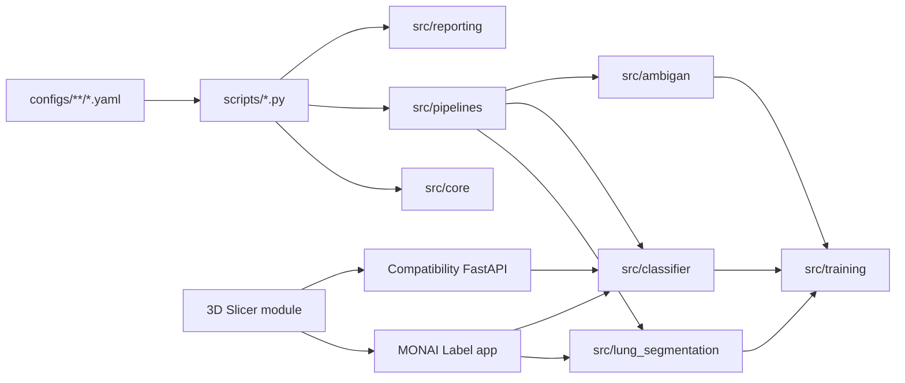
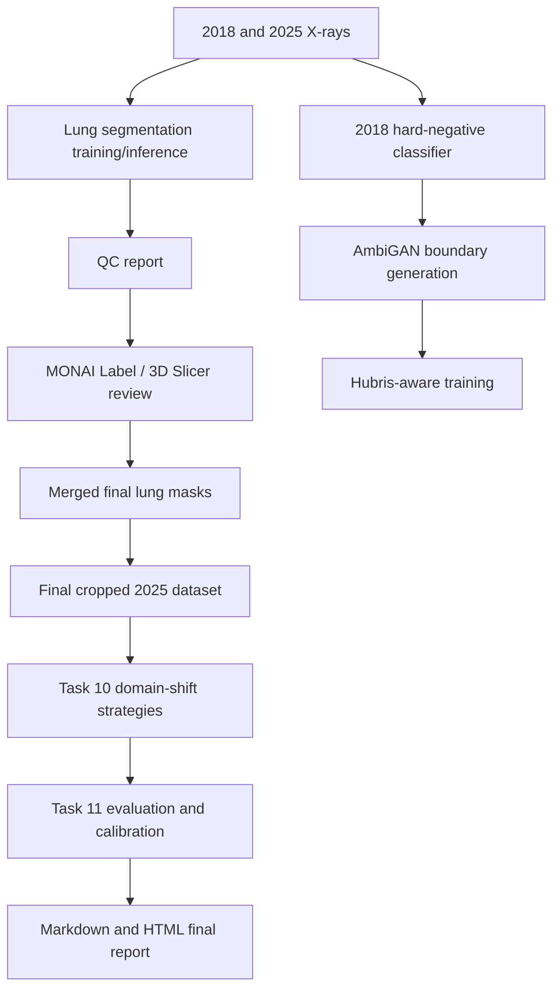

# Project Architecture

## Overview

The project separates declarative configuration, executable entrypoints,
reusable implementation, interactive review applications, and runtime
artifacts.



## Production Flow



## Full Pipeline Orchestration

`scripts/run_full_pipeline.py` loads
`configs/pipelines/full_pipeline.yaml` and delegates to
`src.pipelines.full_pipeline.FullPipelineRunner`.

The runner provides:

- YAML stage enable/disable.
- Ordered dependencies.
- Multiple commands per stage.
- Output validation for files, directories, JSON, CSV, and YAML.
- Resume when declared outputs remain valid.
- Per-stage force reruns.
- State, config snapshot, logs, and metadata.
- Non-executing dry-run validation.

Default stages:

```text
hard_negative_classification
ambigan_boundary_generation
hubris_aware_training
slicer_preparation
slicer_label_review          disabled/manual
slicer_merge_and_crop        disabled until labels exist
classification_2025
evaluation_and_ablation
```

Segmentation model training and MONAI server startup remain explicit production
operations rather than automatic full-pipeline stages.

## Module Ownership

| Package | Responsibility |
|---|---|
| `src/core` | YAML loading, path resolution, experiment directories, logging, reproducibility |
| `src/training` | Shared trainer, checkpoint, optimizer, scheduler, early stopping |
| `src/lung_segmentation` | Dataset, U-Net model, prediction, postprocessing, QC, crops, export |
| `src/classifier` | MobileNetV2 data, training, inference, TTA, calibration, evaluation |
| `src/ambigan` | GAN models, losses, oracle, boundary generation, Hubris score |
| `src/pipelines` | Advanced classification, AmbiGAN, Hubris, Slicer, full orchestration |
| `src/reporting` | Final Markdown/HTML report assembly |

## Application Boundaries

### MONAI Label

`monai_apps/lung_monai_app/main.py` dynamically registers lung segmentation,
classifier inference, and review strategies. It loads the deployed lung model
from the app model directory and the classifier from the central checkpoint
directory.

### 3D Slicer

`PneumoniaPredictor.py` is a Slicer scripted module. It opens MONAI Label for
mask refinement and calls the MONAI classifier endpoint for probabilities and
Grad-CAM.

### Compatibility API

`pneumonia_slicer_app/backend/app.py` exposes FastAPI `/predict` and
`/predict_gradcam` endpoints. It prefers the central classifier checkpoint and
retains a backend-local fallback for compatibility.

## Configuration Model

YAML files compose defaults relative to their own location:

```text
configs/base/             Shared defaults
configs/datasets/         Dataset paths and split definitions
configs/models/           Model architecture defaults
configs/preprocessing/    Resize and ROI behavior
configs/augmentations/    Reusable augmentation policies
configs/training/         Shared training policy
configs/experiments/      Runnable experiment composition
configs/pipelines/        Multi-stage workflow definitions
configs/legacy/           Archived, non-production configuration
```

Each experiment saves its resolved configuration as `config_used.yaml`.

## Runtime Artifacts

```text
data/          Source data, manifests, masks, corrected labels, final datasets
checkpoints/   Stable deployed or manually selected model checkpoints
outputs/       Immutable run directories, evaluation artifacts, reports
```

These directories are runtime state and are not part of source cleanup.

## Final Repository Structure

```text
xray_pneumonia_project/
  configs/
    augmentations/
    base/
    datasets/
    experiments/
    legacy/
    models/
    pipelines/
    preprocessing/
    training/
  docs/
    train_guide.md
    evaluation_guide.md
    monai_label_guide.md
    slicer_guide.md
    project_architecture.md
  environment/
  monai_apps/lung_monai_app/
  notebooks/
    legacy/
  pneumonia_slicer_app/
  scripts/
    dev/
    legacy/
    legacy_validation/
  src/
    ambigan/
    classifier/
    core/
    lung_segmentation/
    pipelines/
    reporting/
    training/
  tests/
    fixtures/
    integration/
    parity/
    unit/
```

## Verification Boundary

The production baseline is:

```powershell
python scripts/run_full_pipeline.py --dry-run
python -m unittest discover -s tests -t .
```

Long-running model training and manual Slicer review require their real data,
checkpoints, and human validation and are intentionally outside automated unit
test execution.
